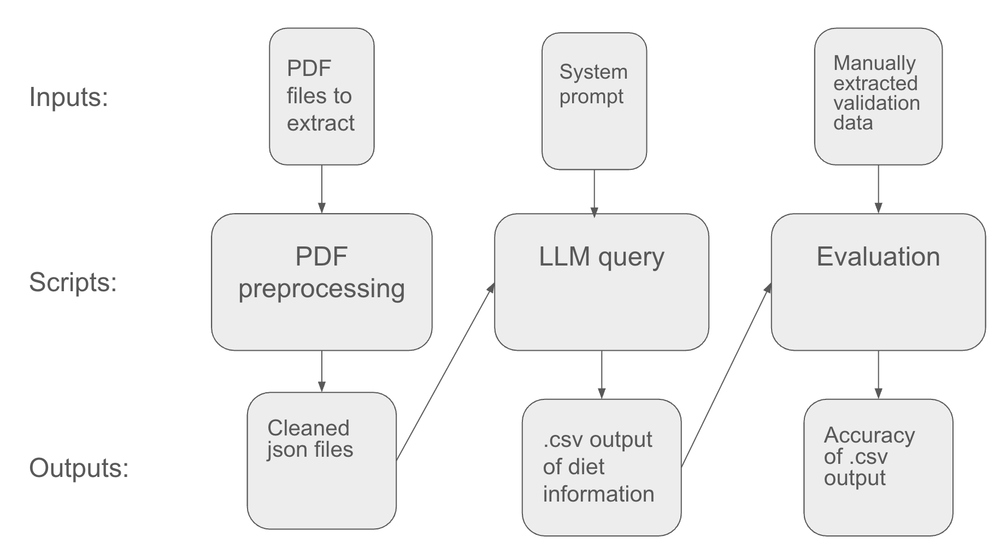

# CTC Alliance Bioversity-CIAT 2025

## Evidence for Agricultural Resilience: Automating Diet Information Extraction

This repository contains an AI workflow that automates extracting diet information from scientific livestock experimental papers and evaluates it against human-supplied extraction results.

## Introduction
The students that worked on this project are part of the Code the Change club at Harvey Mudd College, and the project took place during the 2025-2026 school year. We worked with the Alliance-Bioversity CIAT in collaboration with their Evidence for Resilient Agriculture (ERA) project, which is building a database of livestock practices/outcomes to inform sustainable livestock practices. Creating this database involves extracting relevant data from many scientific papers about livestock management, which is a time and labor intensive process. One method to streamline this process is to use LLMs to automate data extraction. Therefore in this project we sought to build a workflow to automate the extraction of diet information from livestock papers using LLMs. 

## File System

```text
Alliance-Bioversity-CIAT/
├── README.md: Project overview, usage instructions, and implementation notes.
├── requirements.txt: Python dependencies for the full workflow.
├── main.py: Runs the full pipeline end-to-end.
├── query.py: Queries the LLM to extract diet information from cleaned paper text.
├── evaluate.py: Compares LLM outputs against validation data and calculates accuracy.
├── validation.csv: Human-supplied ground truth used for evaluation.
├── pdf_processing/
│   ├── README.md: Detailed notes for the PDF processing subpipeline.
│   ├── requirements.txt: Additional dependencies for PDF processing experiments.
│   ├── pdf_main.py: Runs PDF cleaning for every PDF in pdf_processing/pdfs/.
│   ├── pdf_to_markdown.py: Converts a PDF into a Markdown file.
│   ├── mdtojson.py: Turns Markdown into structured JSON split into sections.
│   ├── json_editor.py: Cleans extracted JSON text.
│   ├── paper_flagger.py: Flags cleaned papers for acceptable units and grazing mentions.
│   ├── table_extractor.py: Extracts tables from cleaned JSON files using the OpenAI API.
│   ├── pdfs/: Input folder where users place PDFs.
│   └── mds/: Generated markdown, JSON, cleaned JSON, and optional extracted table outputs.
├── qa_qc/
│   ├── build_qaqc_summary.py: Builds the combined paper-level QA/QC summary.
│   ├── weight_checks.py: Queries animal weight information for papers with weight-relative units.
│   ├── unit_flag.py: Flags diet rows with potentially unrealistic feed amounts.
│   └── tools/: Helper scripts for checking note-to-paper matching.
└── outputs/
    ├── all_outputs.csv: Test-run LLM diet extraction output with one row per extracted diet ingredient.
    ├── evaluation_results.csv: Test-run accuracy results comparing all_outputs.csv against validation.csv.
    └── paper_qaqc_summary.csv: Test-run paper-level QA/QC summary with evaluation, unit, grazing, and weight flags.
```


## Usage

1. Copy your PDF files into:

```text
pdf_processing/pdfs/
```

2. Create a `.env` file in the root of this repository:

```text
OPENAI_API_KEY=your_api_key_here
OPENAI_MODEL=gpt-4o-mini
```

3. Create a virtual environment and install dependencies:

```bash
python -m venv .venv
source .venv/bin/activate
python -m pip install -r requirements.txt
```

On Windows, activate the virtual environment with:

```bash
.venv\Scripts\activate
```

4. Run the full pipeline from the repository root:

```bash
python main.py
```

The pipeline will:

- convert PDFs into markdown and cleaned JSON files in `pdf_processing/mds/`
- query the LLM for diet information and write `outputs/all_outputs.csv`
- compare predictions against `validation.csv`
- write evaluation and QA/QC summary outputs to `outputs/`

The OpenAI API is used during the LLM extraction and QA/QC steps.

### PDF Cleaning and Table Extraction

This project includes a pipeline that takes scientific papers as PDFs and produces a `pdf_processing/mds/` folder containing Markdown files, JSON files, cleaned JSON files, and optional extracted table CSVs. To run the PDF processing subpipeline by itself, go to the repository root and run `python -m pdf_processing.pdf_main`. Our implementation is based on The Nature Conservancy’s PDF processing pipeline (https://github.com/tixie2027/The-Nature-Conservancy/tree/main/pdf_processing). The JSON outputs store the full text of each paper, organized by section for easy readability, and the optional CSV outputs in `pdf_processing/mds/tables/` store tables extracted from each PDF.

For more specific information about pdf cleaning and the table extraction option, please see the README.md in the `pdf_processing` folder.

### Customization
This workflow can be adapted to extract other types of information from scientific papers. To modify the extraction task, edit the LLM instructions in `query.py`, especially the `pre_prompt` and `user_query_default` variables.

To evaluate the workflow against a different ground-truth dataset, upload a new dataset to replace the validation file `validation.csv`, and if it has a different name then the path stored in `VALIDATION_DATA_PATH` in `main.py` must also be updated. Depending on the structure of the new validation data, `evaluate.py` may also need to be updated so that the model outputs and validation rows are compared using the appropriate columns and matching logic.


## High level Pipeline: 



Running `python main.py` executes the full workflow in four steps:

1. `pdf_processing/pdf_main.py`

Input: PDF files in `pdf_processing/pdfs/`.
Output: Markdown, JSON, cleaned JSON, and paper-flag files in `pdf_processing/mds/`.

`pdf_main.py` loops through each PDF and runs the PDF cleaning subpipeline. For each PDF, `pdf_processing/pdf_to_markdown.py` converts the PDF to Markdown, `pdf_processing/mdtojson.py` converts the Markdown into section-based JSON, and `pdf_processing/json_editor.py` cleans extracted text artifacts. `pdf_processing/paper_flagger.py` also creates paper-level flags for acceptable units and grazing mentions.


2. `query.py`

Input: Cleaned JSON files in `pdf_processing/mds/`.
Output: `outputs/all_outputs.csv`, containing the diet rows extracted by the LLM.

`query.py` builds a diet-extraction prompt, sends cleaned paper text to the selected OpenAI model, parses the model's returned CSV, and adds the paper ID as `B.Code`.


3. `evaluate.py`

Input: `outputs/all_outputs.csv` and `validation.csv`.
Output: `outputs/evaluation_results.csv`.

`evaluate.py` matches model-output rows to validation rows within each paper using fuzzy matching on diet name and ingredient name. It then compares shared columns to calculate per-paper and per-column accuracy.


4. `qa_qc/build_qaqc_summary.py`

Input: Cleaned JSON files in `pdf_processing/mds/`, model outputs in `outputs/all_outputs.csv`, and validation data in `validation.csv`.
Output: `outputs/paper_qaqc_summary.csv`.


`build_qaqc_summary.py` combines paper-level flags, evaluation scores, and weight-related QA/QC outputs into one summary file. It includes acceptable-unit flags, grazing flags, grazing-management notes, animal-weight information, and evaluation accuracy columns.


The QA/QC summary includes the following paper-level columns:

- `has_acceptable_units`: Whether the cleaned paper text contains units that the workflow considers usable for diet extraction.
- `mentions_grazing`: Whether the paper mentions grazing or pasture-related terms.
- `grazing_terms_found`: The specific grazing or pasture terms found in the paper.
- `grazing_management_reported`: For papers mentioning grazing, whether the LLM found grazing-management details such as duration, species, stocking rate, or pasture composition.
- `grazing_management_notes`: Short LLM-generated notes explaining the grazing-management flag.
- `weight_mean`, `weight_stdev`, `weight_units`, `weight_info`: Animal-weight information extracted for papers where diet amounts use body-weight-relative units.

## Initial results 

A test run was completed on 20 papers randomly sampled from the PDFs shared by the ERA team. The main generated outputs are stored in `outputs/`:

- `outputs/all_outputs.csv`: Diet ingredient rows extracted by the LLM. Each row contains a paper ID, diet name, ingredient, ingredient type, amount, unit, dry/ad libitum flags, and notes.
- `outputs/evaluation_results.csv`: Accuracy results from comparing `outputs/all_outputs.csv` against `validation.csv`. This file includes one row per evaluated paper plus a total row.
- `outputs/paper_qaqc_summary.csv`: Paper-level QA/QC summary combining evaluation scores, unit flags, grazing flags, grazing-management notes, and animal-weight information where relevant.

The test run used `gpt-4o-mini`. Across the evaluated papers, the total accuracy was 37.70%. Accuracy was strongest for `D.Amount` at 67.74%, followed by `D.Item` at 61.29% and `D.Type` at 52.26%. Accuracy was weakest for `D.Unit.Amount` at 8.39%, `D.Ad.lib` at 21.29%, and `A.Level.Name` at 25.81%. The highest-scoring papers were `HK0028` at 51.19%, `JS0309` at 50.00%, and `JO1044` at 47.96%. Several papers scored 0.00%, which indicates that the current evaluation method did not find sufficiently matched diet/item rows between the model output and validation data.

The `gpt-4o-mini` test cost about 2 cents for 10 papers, or about 0.2 cents per paper.


## How it was made

This workflow was inspired by the ERA team’s AI extraction walkthrough: https://eragriculture.github.io/ERL/Use_of_AI_for_Extraction.html. The PDF processing portion also builds on The Nature Conservancy’s PDF processing workflow: https://github.com/tixie2027/The-Nature-Conservancy/tree/main/pdf_processing.

### PDF cleaning and table extraction

The PDF processing code lives in `pdf_processing/`. The pipeline starts with PDFs in `pdf_processing/pdfs/`. `pdf_processing/pdf_to_markdown.py` uses Docling to convert each PDF into Markdown. `pdf_processing/mdtojson.py` then splits that Markdown into a JSON structure organized by section headings. `pdf_processing/json_editor.py` cleans common PDF extraction artifacts, including unusual characters, encoding issues, and whitespace problems. The resulting cleaned files are saved in `pdf_processing/mds/` as `cleaned_<paper_id>.json`.

The optional table extraction step is handled by `pdf_processing/table_extractor.py`. It flattens the cleaned JSON text, sends it to the OpenAI API, asks the model to identify tables, and writes each extracted table as a CSV file under `pdf_processing/mds/tables/`.

### LLM query and response

The main diet extraction prompt is defined in `query.py`. The script builds a system prompt that tells the model to answer only from the provided paper text, then asks for a CSV table of diet ingredients. The requested output columns are:

```text
B.Code, A.Level.Name, D.Item, D.Type, D.Amount, D.Unit.Amount, DC.Is.Dry, D.Ad.lib, Notes
```

The script reads cleaned JSON files from `pdf_processing/mds/`, excludes back-matter sections such as references and acknowledgements, queries the selected OpenAI model, parses the returned CSV, adds the paper ID as `B.Code`, and saves the combined result to `outputs/all_outputs.csv`.

### Evaluation of response

The evaluation code lives in `evaluate.py`. It compares `outputs/all_outputs.csv` against `validation.csv`, which is the human-supplied ground truth. Rows are matched within each paper using fuzzy matching on diet name and ingredient name. After rows are matched, the script compares shared columns exactly after normalizing capitalization, blank values, `NA`, and numeric formatting.

The evaluation reports per-paper accuracy and per-column accuracy. Validation rows that cannot be matched to model output rows do not contribute matched-cell scores, and model output rows that cannot be matched to validation rows are not scored. This means the evaluation measures accuracy over matched rows rather than full recall over every expected row.

### QA/QC

The QA/QC code lives in `qa_qc/`. `qa_qc/build_qaqc_summary.py` builds the combined paper-level summary in `outputs/paper_qaqc_summary.csv`.

The QA/QC process includes:

- Valid units: `pdf_processing/paper_flagger.py` checks whether each cleaned paper contains diet-relevant units such as `%`, `g`, `kg`, `g/kg`, `ml`, or body-weight-relative units.
- Grazing: `pdf_processing/paper_flagger.py` checks for grazing and pasture-related terms. If grazing is mentioned, the workflow asks the LLM whether grazing-management details are reported.
- Weight information: `qa_qc/weight_checks.py` identifies papers where diet amounts are given relative to animal weight and asks the LLM to extract animal body-weight information.
- Realistic amounts: `qa_qc/unit_flag.py` uses extracted weight information to normalize some feed amounts to grams and flags values that appear unrealistically high or low.

## Future Directions

- Querying:
    - Split the extraction task into multiple model calls, with each call responsible for a smaller set of output columns.
    - Define stricter requirements for the values allowed in each output column.
    - Use structured model outputs, when available, to produce JSONL or another structured format rather than relying on a manually prompted CSV response.
- Models:
    - Evaluate the pipeline with additional models, such as Gemini, Claude, Llama, and other open or proprietary systems, and compare both performance and cost.
    - Consider using a model-routing service such as OpenRouter to make it easier to test multiple models with a consistent API interface.
- Harmonization:
    - Incorporate ingredient-name harmonization into the workflow, since different papers often refer to the same ingredients using different names.
